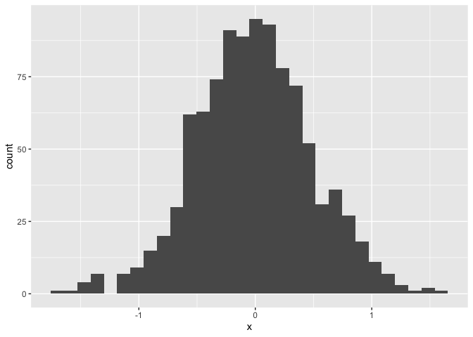
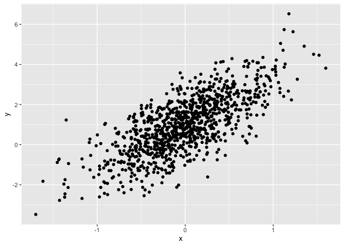

Basic Plots - Lecture 3
================
Rezwana Habib
2026-09-26

# Basic Plots

This document demonstrates how to create a histogram and scatterplot
using ggplot.

## Create the Dataframe

``` r
set.seed(1234)

plot_df = tibble(
  x = rnorm(1000, sd = .5),
  y = 1 + 2 * x + rnorm(1000)
)
```

## Histogram

The following histogram displays the distribution of x.

``` r
ggplot(plot_df, aes(x = x)) +
  geom_histogram()
```

    ## `stat_bin()` using `bins = 30`. Pick better value `binwidth`.

<!-- -->

## Scatterplot

The following scatterplot displays the relationship between x and y.

``` r
ggplot(plot_df, aes(x = x, y = y)) +
  geom_point()
```

<!-- -->
